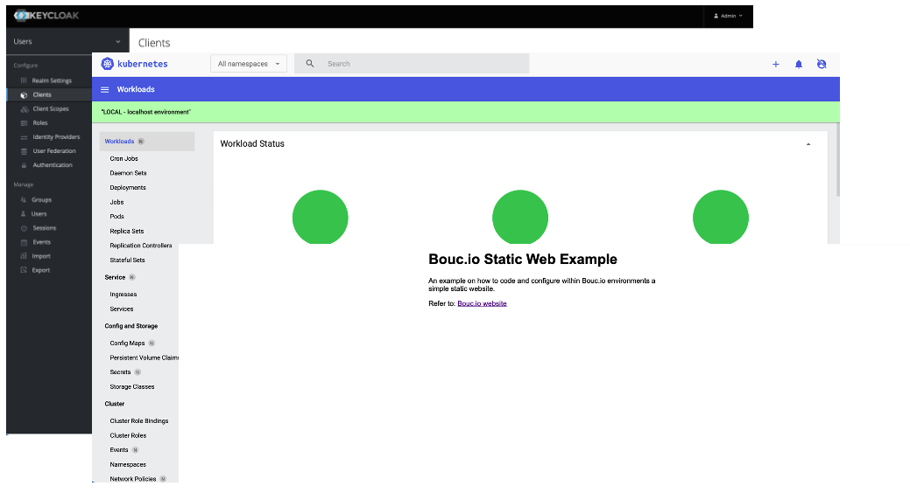

# Bouc.io — Open Source Sandbox Platform

Bouc.io is a personal, highly opinionated, open-source sandbox used for learning and staying sharp.
It puts "all the pieces together": a cloud-native Kubernetes platform — GitOps delivery (FluxCD),
service mesh (Istio), TLS (cert-manager), identity (Keycloak + OAuth2-Proxy), observability
(Prometheus, Grafana, OpenTelemetry, Kiali) — plus a working **AI assistant platform** with agent
orchestration, long-term memory, tool use, web UIs, and a CLI.

All repositories live under the [bouc-io GitLab group](https://gitlab.com/bouc-io).



## Why Bouc.io?

I started this project on my own time to keep my skills current with the technologies used by the
best infrastructure teams. There are plenty of piecemeal tutorials out there, but very few show how
to wire everything into a workable, viable platform — so that's what Bouc.io is. I don't claim it's
the "perfect setup," but it works, and it covers most of what a typical web or AI workload needs.

Hopefully you'll find it useful for your own learning. Enjoy!
— [@martincote.ca](https://martincote.ca/)

## What's Inside

- **infrastructure** — Kubernetes add-ons: cert-manager, Istio, Keycloak, OAuth2-Proxy,
  external-dns, external-secrets, metrics-server, Prometheus, Grafana, OpenTelemetry, Kiali, Datadog.
- **fluxcd** — GitOps manifests reconciling the whole cluster state.
- **application** — the AI assistant platform (agent, chatbot, memory, admin, portal + UIs and CLI).
- **inference** — Helm chart deploying Ollama on-cluster for LLM serving.
- **documentation** — this getting-started guide and setup scripts.

## Getting Started

**Prerequisite:** [Homebrew](https://brew.sh) — the setup script uses it to install all tools.

1. Create a workspace root folder (e.g. `~/bouc_io_wksp`).
2. Run the setup script to install tools (Git, Helm, kubectl, Flux, …), create the folder
   structure, and clone the repositories:
   ```shell
   chmod +x init-local-infra.sh
   ./init-local-infra.sh
   ```
   The script is idempotent — safe to re-run; it skips what's already installed or cloned.

**Local Kubernetes:** any local cluster works (Docker Desktop, Rancher Desktop, Kind). See the
`infrastructure` component READMEs for cluster-specific setup.

### Hosts File

To reach local services, add to `/etc/hosts`:

```shell
127.0.0.1 docker.internal
127.0.0.1 www.docker.internal
127.0.0.1 api.docker.internal
127.0.0.1 authz.app.docker.internal
127.0.0.1 test.api.docker.internal
127.0.0.1 kubernetes-dashboard.app.docker.internal
127.0.0.1 authn.app.docker.internal
```

Default local logins are typically `admin`/`admin` or `user-1`/`user-1`.

## Consuming the Public Artifacts

Images and Helm charts are published to GitHub Container Registry, public and unauthenticated.
Charts are OCI artifacts, so no `helm repo add` is needed:

```shell
helm install agent oci://ghcr.io/bouc-io/charts/agent-api-chart --version 0.2.5
```

```shell
docker pull ghcr.io/bouc-io/application/agent/agent-api-server:latest
```

Image paths mirror the source layout: `ghcr.io/bouc-io/application/<domain>/<service>`. Every image
is built for `linux/amd64` and `linux/arm64`, so an ARM cluster (Raspberry Pi, Jetson, Apple
silicon) works without a rebuild.

Chart defaults already point at ghcr.io. To relocate everything to your own registry, override the
registry rather than editing each image reference:

```shell
helm install agent oci://ghcr.io/bouc-io/charts/agent-api-chart \
  --set global.imageRegistry=my-registry.example.com/bouc-io
```

### Third-party images

The bundled database and cache subcharts still pull from Docker Hub, which enforces anonymous pull
rate limits and, in the case of Bitnami's archive namespace, no longer receives security updates.
Relocating them is a cluster-level concern, not a values edit. Two standard approaches:

- **containerd registry mirrors** — point `docker.io` at your own pull-through cache in the node
  configuration. Transparent to every chart.
- **A Kyverno mutating policy** (`replace-image-registry`) — rewrites image references admission-side
  across the whole cluster.

Either relocates third-party pulls without forking any chart. For production, supply your own
database and cache instead of the bundled ones.

For publishing these artifacts (maintainers only), see
[`PUBLISH-GHCR-RUNBOOK.md`](PUBLISH-GHCR-RUNBOOK.md).

## AI Assistant Platform

The `application/` services form a multi-service AI assistant that runs locally or on the cluster,
backed by Ollama (Qwen 3.5) or the Anthropic API.

```
 monochrome-*-ui (React/Vite)                 agent-cli (terminal)
        │  SSE streaming (Redis pub/sub)              │
        ▼                                             ▼
  agent-api-server  ── retrieval ─▶  memory-api-server  (pgvector search)
  (Node/Express)                          ▲
  - Planner → Executor loop               │ post-run distillation
  - BullMQ workers, tool registry         ▼
  - LLM routing (Anthropic/OpenAI/   memory-distiller (Python/FastAPI)
    Ollama) via admin-api-server
```

| Service | Role |
|---|---|
| [agent-api-server](https://gitlab.com/bouc-io/application/agent/agent-api-server) | Agentic backend: two-phase planner/executor, tool calling, SSE streaming |
| [memory-api-server](https://gitlab.com/bouc-io/application/memory/memory-api-server) | pgvector memory retrieval (tiered: critical-first, then semantic) |
| [memory-distiller](https://gitlab.com/bouc-io/application/memory/memory-distiller) | LLM pipeline that distills conversations into durable memories |
| [admin-api-server](https://gitlab.com/bouc-io/application/admin/admin-api-server) | LLM providers/assignments, orgs, global/org instructions |
| [portal-api-server](https://gitlab.com/bouc-io/application/portal/portal-api-server) | Personal user-scoped instructions, billing |
| [chatbot-api-server](https://gitlab.com/bouc-io/application/chatbot/chatbot-api-server) | Legacy direct-LLM chatbot (superseded by agent-api-server) |
| [apidocs-api-server](https://gitlab.com/bouc-io/application/apidocs/apidocs-api-server) | Aggregates every service's OpenAPI spec behind one Swagger UI |
| monochrome-*-ui / [agent-cli](https://gitlab.com/bouc-io/application/cli/agent-cli) | React/Vite frontends per domain; terminal client |

**Local dev prerequisites:** Node.js 20+, Python 3.11+, PostgreSQL 14+ with **pgvector**, Redis 7+,
and Ollama (or an OpenAI-compatible / Anthropic endpoint). Each service ships a `.env.example` and
README.

**API documentation:** every backend serves its own Swagger UI at `/api-docs` and its raw spec at
`/openapi.json`, in all environments. Neither path is routed at the Istio edge, so they are reachable
in-cluster only. The one public entry point is `apidocs-api-server`, which fans out to those specs
over the mesh and serves them behind a single service selector at
`https://api.<CLUSTER_DOMAIN>/v1/api-docs` (behind Keycloak login via oauth2-proxy).

## License

[Elastic License 2.0](https://www.elastic.co/licensing/elastic-license) — source-available.
You may use, copy, modify, and self-host the software, but may not provide it to
third parties as a hosted or managed service. See each component's `LICENSE` file.
